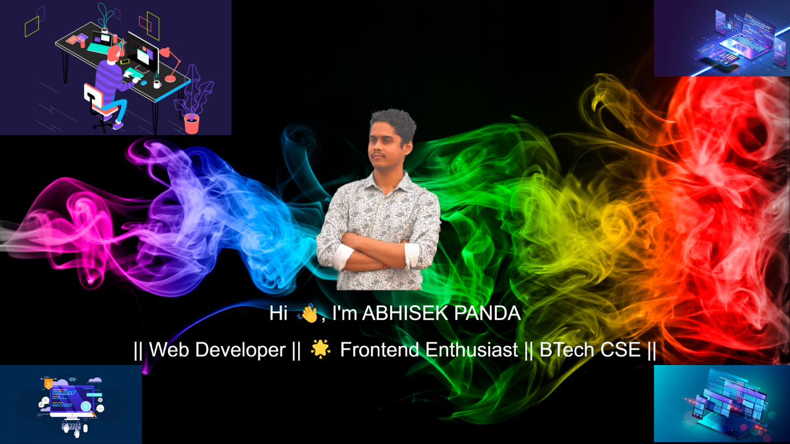
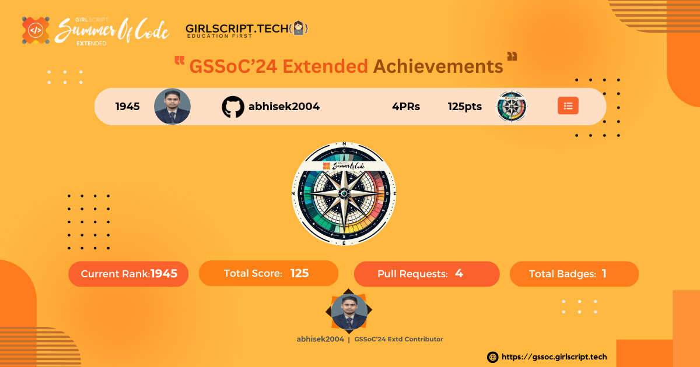

<!--
### Hi there 👋
**abhisek2004/abhisek2004** is a ✨ _special_ ✨ repository because its `README.md` (this file) appears on your GitHub profile.

Here are some ideas to get you started:

- 🔭 I’m currently working on ...
- 🌱 I’m currently learning ...
- 👯 I’m looking to collaborate on ...
- 🤔 I’m looking for help with ...
- 💬 Ask me about ...
- 📫 How to reach me: ...
- 😄 Pronouns: ...
- ⚡ Fun fact: ...
-->

<!---->

<!-- <h3 align="center"> MERN , JAVA & DSA || Web Developer || 🌟 Frontend Enthusiast || BTech CSE</h3> -->
<!--  -->

<!-- Night Owl image -->
<!--

  

-->
<!--      
      
      
      
      
      
      -->

<!--<h1 align="center">Hi 👋, I'm ABHISEK PANDA</h1>-->

  

  

  

### 🌟 **MERN, Java & DSA** | CSE Pre Final Year | Tech Innovator

  
  
  

 

"Hi I’m 𝐀𝐛𝐡𝐢𝐬𝐞𝐤, My name signifies 'anointing' or 'consecration.' I’m on a journey to build a fulfilling career with dedicated and passionate people who can help me discover my potential. I’m excited to be a key player in a creative and dynamic environment, using my skills to make a positive impact along the way."

### 
My Technical Skills

  

  

### 🌟 About Me

<i>&nbsp;
✨ "Embrace every challenge with optimism, and let hope light the way!" ✨</i>  

  

👨‍🎓 I’m currently pursuing a **Bachelor of Technology** in **Computer Science** at **GIET University, Gunupur**. My journey in tech is fueled by a passion for mastering the **MERN Stack**, along with skills in **Java**, and **Data Structures & Algorithms**.

🏫 My academic path began at **St. Xavier's Sr. Secondary School, Jajpur Road**, where I completed both my Intermediate and Matriculation. I thrive on setting ambitious goals and constantly seek opportunities for growth and innovation.

🔥 &nbsp; With an impressive following of 2k+ followers on [Linkedin](https://www.linkedin.com/in/abhisekpanda2004/).

💬 One of my key strengths is effective communication, which helps me collaborate seamlessly within teams. I am goal-oriented and strive for excellence, fostering a supportive environment for collective success.

🎨 I have a passion for crafting immersive user experiences through **frontend development**. Embracing challenges is part of my journey, and I’m eager to contribute my skills to impactful projects.

🚀 I’m on the lookout for opportunities where I can bring my determination and commitment to teamwork, with aspirations to make meaningful contributions in the world of web development. My dream companies include **Microsoft**/ **Samsung**/ **TCS**.

  
🏆 Certificates

   

📄 Below is a showcase of my knowledge and skills across a wide range of Competitive Programming and Development.
 

| S.No. | Achievement Name           | Issuing Authority |       Date        | Details                                                                                                                                                                       | Credential |
| :---: | :------------------------- | :---------------: | :---------------: | :---------------------------------------------------------------------------------------------------------------------------------------------------------------------------- | :--------- |
|  1.   | GSSOC’24                   |   GSSOC’24 EXT    | Oct '24 - Present | Actively contributing to open-source projects (04 PRs accepted), showcasing development and practical experience. Rank 250 in GSSOC’24 EXT.                                      | [View]()   |

  

  
<strong>
    "🎓 College. ☕️ Coffee. 💻 Code. Repeat."
      
    Vibing to: 🎧
  </strong>

<h2 align="center">🏆 Github Profile Trophy</h2>

<a href="https://github-profile-trophy.vercel.app/?username=abhisek2004&no-bg=true">

## 🏆 GSSoC 2024 Extended Badge🪶✨

  

    
    
Badge 1: Beginner

  

    
  <!--
  
  
  
  
  -->

<h3> 📱 Social 🌐 </h3>
<table>
    <tr>
        <td><strong>CodePen</strong></td>
        <td>
            
        </td>
    </tr>
    <tr>
        <td><strong>CodeChef</strong></td>
        <td>
            
        </td>
    </tr>
    <tr>
        <td><strong>HackerRank</strong></td>
        <td>
            
        </td>
    </tr>
    <tr>
        <td><strong>Codeforces</strong></td>
        <td>
            
        </td>
    </tr>
    <tr>
        <td><strong>LeetCode</strong></td>
        <td>
            
        </td>
    </tr>
    <tr>
        <td><strong>HackerEarth</strong></td>
        <td>
            
        </td>
    </tr>
    <tr>
        <td><strong>Discord</strong></td>
        <td>
            
        </td>
    </tr>
<!--     <tr>
        <td><strong>Dev.to</strong></td>
        <td>
            
        </td>
    </tr> -->
</table>

  <h2 style="color: #2e8b57;">🌟 Trying to Touch and Learn 1 New Thing Everyday! 🌟</h2>
  

    🌱 Embrace the adventure of learning and personal growth.
    ✨ Let my curiosity lead to exciting new horizons!
  

  

<!--   -->
<h3> 💻 Languages, Tools and Technologies 🚀  </h3>

<table>
    <tr>
        <td><strong>Programming Languages</strong></td>
        <td></td>
    </tr>
    <tr>
        <td><strong>Database Technologies</strong></td>
        <td></td>
    </tr>
    <tr>
        <td><strong>Frontend Technologies</strong></td>
        <td></td>
    </tr>
    <tr>
        <td><strong>Backend Development</strong></td>
        <td></td>
    </tr>
    <tr>
        <td><strong>Developer Tools</strong></td>
        <td></td>
    </tr>
    <tr>
        <td><strong>Design Tools</strong></td>
        <td></td>
    </tr>
<tr>
        <td><strong>Deployment Platforms</strong></td>
        <td></td>
    </tr>
</table>
 

<h3>Holopin badges👀 </h3>
 
  

<h2 align="center">📊 Gɪᴛʜᴜʙ Sᴛᴀᴛs 📊</h2>
<table width="100%">
  <tr>
    <td width="50%">
      <h3 align="center"><strong>Rᴇᴘᴏs Pᴇʀ Lᴀɴɢᴜᴀɢᴇ</strong></h3>
      

        
      

  <h3 align="center"><strong>Mᴏsᴛ Cᴏᴍᴍɪᴛ Lᴀɴɢᴜᴀɢᴇ</strong></h3>
      

        
      

   <h3 align="center"><strong>Sᴛᴀᴛs</strong></h3>
      

        
      

  <h3 align="center"><strong>Pʀᴏᴅᴜᴄᴛɪᴠᴇ Tɪᴍᴇ</strong></h3>
      

        
      

   <h3 align="center"><strong>Pʀᴏfɪʟᴇ Dᴇᴛᴀɪʟs</strong></h3>
      

        
      

    </td>
   <td width="50%">
     <h3 align="center"><strong>Additional Stats</strong></h3>
      

        
      

  <h3 align="center"><strong>GitHub Stats</strong></h3>
      

        
      

   <h3 align="center"><strong>Streak Stats</strong></h3>
      

        
      

  <h3 align="center"><strong>🔝 Top Contributed Repo</strong></h3>
      

        
      

    </td>
  </tr>
</table>

<td width="50%">
  <h3 align="center"><strong>Lᴀᴛᴇsᴛ Pʀᴏᴊᴇᴄᴛ</strong></h3>
  

    
  

</td>

<!--Contribution Graph-->
<h2 align="center">📈 Cᴏɴᴛʀɪʙᴜᴛɪᴏɴ Gʀᴀᴘʜ 📈</h2>

    

<!--Dynamic Quote card updates everyday at 12 PM--> 
<h2 align="center">🌟 Tʜᴏᴜɢʜᴛ ᴏғ ᴛʜᴇ Dᴀʏ 🌟</h2>

<!--STARTS_HERE_QUOTE_CARD-->

    

<!--ENDS_HERE_QUOTE_CARD-->

<!--Contact Section--> 

<h2 align="center">🤝 Cᴏɴɴᴇᴄᴛ Wɪᴛʜ Mᴇ 🤝 </h2>

  

 

  

  

  

<!--Footer--> 

  

